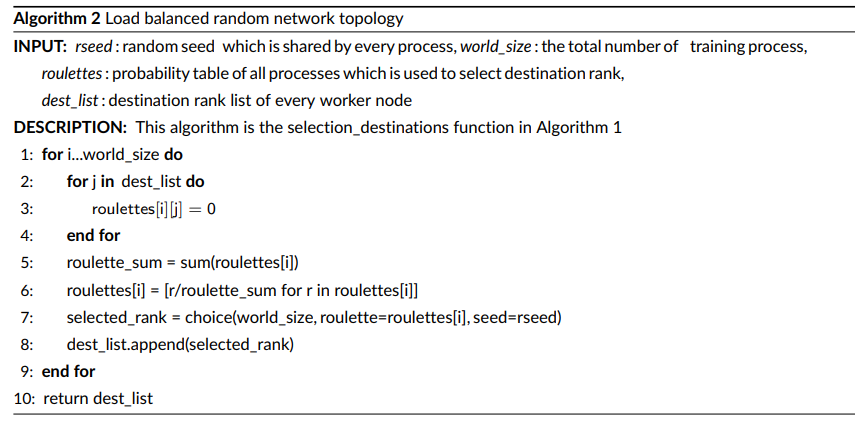
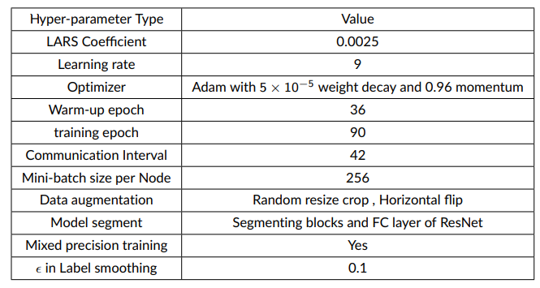
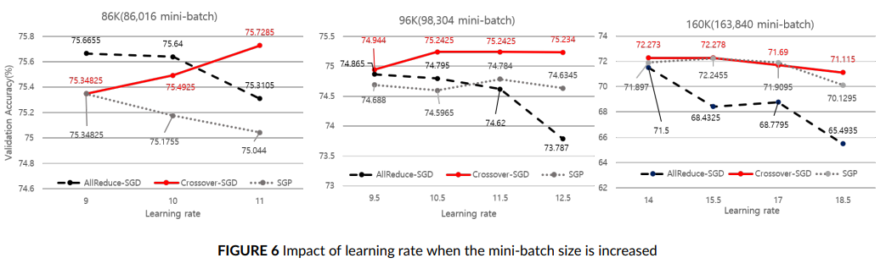
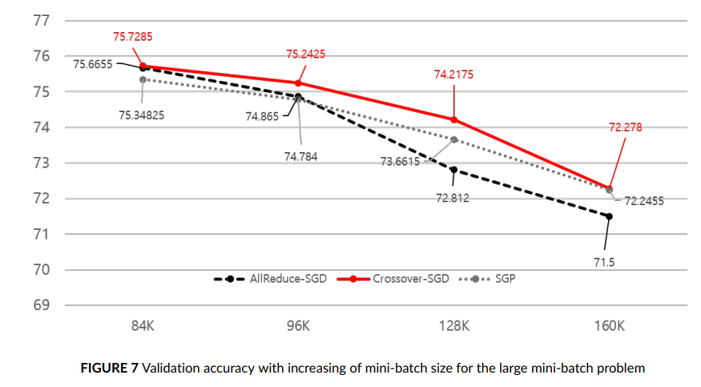
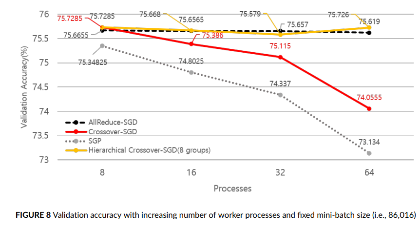

# Crossover-SGD : 


## 1. Motivation
---------------------
* 가십 기반 통신 기법은 낮은 통신 부하로 인해 최근 분산딥러닝에서 연구가 많이 진행됨.
* 가십 기반 통신 기법은 따라서 거대 규모 환경의 분산 딥러닝에서 활용될 수 있으나, 가십 기반 통신으로 인한 모델 갱신 정보의 느린 전파는 전역 모델의 부정확한 모델 갱신을 야기하여 수렴 정확도를 감소시킴
* 거대 규모 환경에서 모델의 부정확한 업데이트로 인한 문제가 경감된 가십 기반 통신을 제안하여 효과적인 분산 딥러닝을 수행하고자 함. 

----
## 2. Objective
-----
* 거대 규모 환경에서의 분산딥러닝 학습 조건은 두가지 요소로 나뉘어 정의됨.
  * 학습 확장성 : 머신의 수가 증가함에 따라 Large minibatch 문제나 부정확한 모델 업데이트로 인한 수렴 정확도 감소가 발생하는지
    * Large mini-batch 문제 : 미니배치 수가 증가함에 따라 학습 반복 횟수가 감소되어 최종 수렴 정확도가 감소하는 문제 
  * 노드 확장성 : 머신 간 학습된 정보에 대한 동기화 과정에서 요구되는 추가적인 통신 부하로 인한 학습 시간 증가 
* Gossip 기반 통신은 높은 "노드 확장성"을 가지나, 통신과정에서의 부정확한 모델 업데이트로 인해 낮은 "학습 확장성"은 가짐
* Gossip 기반 통신의 "학습 확장성" 측면을 분석하기 위해 두 가지 목표를 달성하고자 함.
  * Gossip 기반 통신을 활용할 경우 Large mini-batch 문제의 발생을 분석 
  * "학습 확장성" 측면에서 더 나은 가십 통신 기법을 제시 

----
## 3. Crossover-SGD 
----
* 높은 학습 확장성을 가지는 가십 통신 기법을 제시하기 위해 세 가지의 세부 방안을 제시함.
  * 모델을 분할하고, 분할된 모델의 세그먼트 별로 각각 가십 통신 수행
  * 가십 통신을 위한 모델 갱신 과정에서 특정 로컬 모델에 편향된 모델 갱신을 하지 않기 위해 Load balanced random network topology 를 구성함.

   </img>

  * 머신 수의 증가에 따른 가십 통신의 근본적인 모델 갱신 오차를 줄이기 위해 계층적 통신  기법을 적용함. 

## 4. Experiment Results
-----
### 4.1 실험 환경

* KISTI의 뉴론 클러스터에서 실험을 진행함. 
* 보고된 ResNet50 & 이미지넷 데이터셋에서의 수렴 정확도가 유지되는 최대 미니배치 크기(86,016)에 도달하기 위해 Fujitsu 사의 하이퍼파라미터 세팅을 적용함.
* 실험 과정에서 잘못된 LARS의 구현이 정확도가 떨어짐을 확인하고 MXNet의 LARS 구현을 바탕으로 PyTorch 쪽에 LARS 를 수정함. 
* 학습 시간 감소를 위해 Mixed Precision Training을 적용함. 
* 비교 케이스 
  * AllReduce-SGD : 일반적인 탈중앙화 통신 동기화 기법(모든 모델의 갱신정보를 평균냄)
  * SGP(Stochastic Gradient Push) : 그 당시(2019-2020) 최신 가십 통신 기법
  * Crossover-SGD : 제안 가십 통신 기법 
* 하이퍼 파라미터 설정
   </img>

-----
### 4.2 Large minibatch 문제 조건에서의 가십 통신 기법 분석. 

* 실험 결과 
  * 미니배치가 증가함에 따라 각 통신 기법 별로 최적 learning rate 가 상이함을 확인
    * 이로 인해 각 기법 별로 비교가 더 어려워졌으며 learning rate를 바꿔가며 가장 정확도가 높은 경우를 기준으로 비교를 수행함. 
  * AllReduce-SGD 는 Large mini-batch 문제가 심화될 수록(즉, 미니배치 크기가 증가할 수록) 더 큰 영향(더 낮은 수렴 정확도)을 받음. 
    * 이는 예기치못한 결과로써 가십 통신이 가지는 탐험적 특성이 영향을 주었을것으로 가정함. 

   </img>

    </img>  


-----
### 4.3 제안 기법의 확장성 분석 

* 실험 결과 
  * 학습 확장성 : 기존 Stochastic gradient push 대비 더 높은 학습 확장성을 가지며, 계층적 통신 기법을 적용하는 경우, 가십 통신을 하는 머신의 수를 제한할 수 있으므로 학습 확장성이 유지됨을 확인함. 

   </img>


  * 노드 확장성 : 기존 가십 기법 대비 노드 확장성은 낮으나, AllReduce 대비 노드 확장성이 높음을 확인함. 

   </img>


---------------
## 5. 실행방법. 
-------------------
* 키스티 환경에서 실험하기 위해 Slurm 스크립트를 작성하였고, 파이토치 배포 버전이 아닌 소스 컴파일 버전을 활용하여 싱귤라리티 이미지를 빌드해야함.(이때는 nccl을 백엔드로 설정해서 실행시키는 법을 몰랐음)

* 최신 버전에서는 파이토치 소스 컴파일을 할 필요가 없을것 같지만, 확인해봐야함. 

* 실행 방식 및 스크립트는 scripts 폴더 참조

* 실행 코드 예시(여기서 싱귤라리티 이미지 호출 하지 않고, nccl이 backend 면 다른방식으로 수행시켜야함.)
```
mpirun -n 32  -npernode 4 singularity exec --nv /scratch/x2026a02/200909_pytorch.sif /opt/anaconda3/envs/pytorch4/bin/python /scratch/x2026a02/imagenet_test.py --batch_size 128 --world_size 32 --crossover True --tag $SLURM_JOBID --lars True --allreduce False --amp True --lrdecay poly --lars_coef 0.0025 --baselr 11 --warmup_epoch 36 --local_itr 21 --clip_grad True --sync_grad False --sync_lars_start_epoch 200 --sync_lars_group_size 8 --chromosome fine --maxepoch 90 --manual_seed 776 --gpu_per_node 2

```

* 수정된 실행코드(slurm, nccl 백엔드) 

```
srun /opt/anaconda3/envs/pytorch4/bin/python /scratch/x2026a02/imagenet_test.py --batch_size 128 --world_size 32 --crossover True --tag $SLURM_JOBID --lars True --allreduce False --amp True --lrdecay poly --lars_coef 0.0025 --baselr 11 --warmup_epoch 36 --local_itr 21 --clip_grad True --sync_grad False --sync_lars_start_epoch 200 --sync_lars_group_size 8 --chromosome fine --maxepoch 90 --manual_seed 776 --gpu_per_node 2

```

